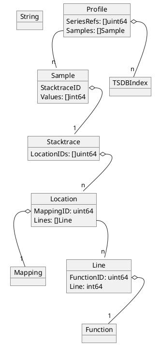

# FireDB

## Data model

The data model store is fairly aligned to Google [proto definition][pprof] for
the pprof wire format. In general strings within those objects are referenced
by their position in a central string array.

There are two type of labels:

* External Labels: Contain additional information gathered at ingestion time
  and can be used to select certain profiles. They are comparable to
  Prometeus'/Loki's label and typical labels are `namespace` and `pod` to
  describe which workload the profiles are coming form.

* Pprof Labels: Part of the pprof payload and used by the agent or the software
  to transport additional information.

Each `Profile` can store multiple profile types. This for example used for
memory profiles where there is typically the allocation/in_use objects and
bytes measured. The different types are represent by External Labels within the
series index. Hence a single `Profile` can contains multiple `SeriesRefs`. The
number of `SeriesRefs` is also exactly matching the number of values within a
`Sample`.

[pprof]: https://github.com/google/pprof/blob/main/proto/profile.proto

## Memory representation `Head`

## On disk representation

### Flushing memory representation to disk

* **Partial flush**: Will flush full rowGroups to the parquet files. This is
  ignored by the TSDB block.

* **Full flush**: Will write TSDB index and all not previously written rows in
  the parquet files and will open a new Head block.

